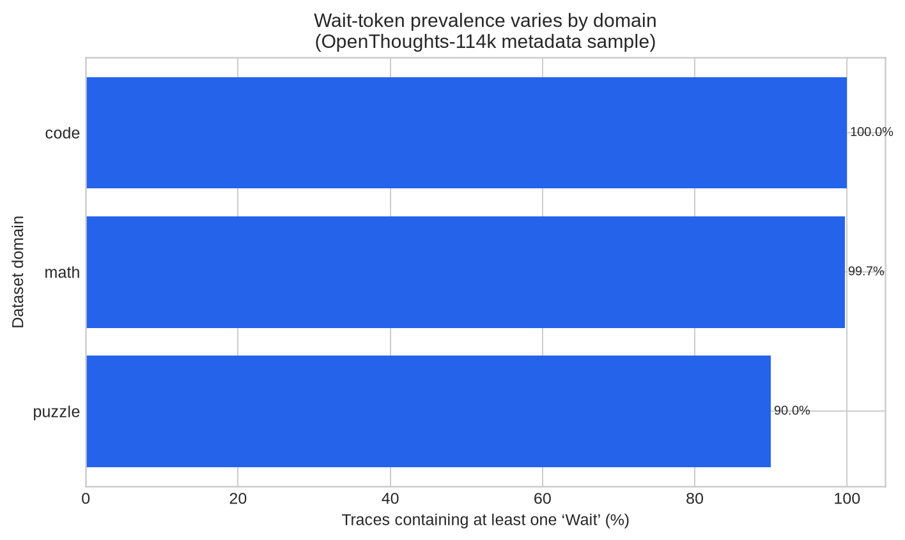
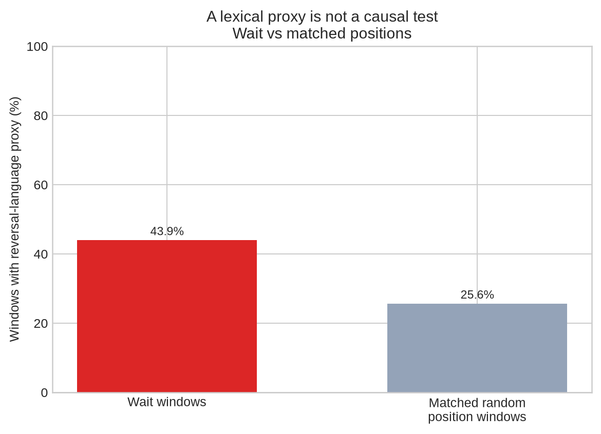
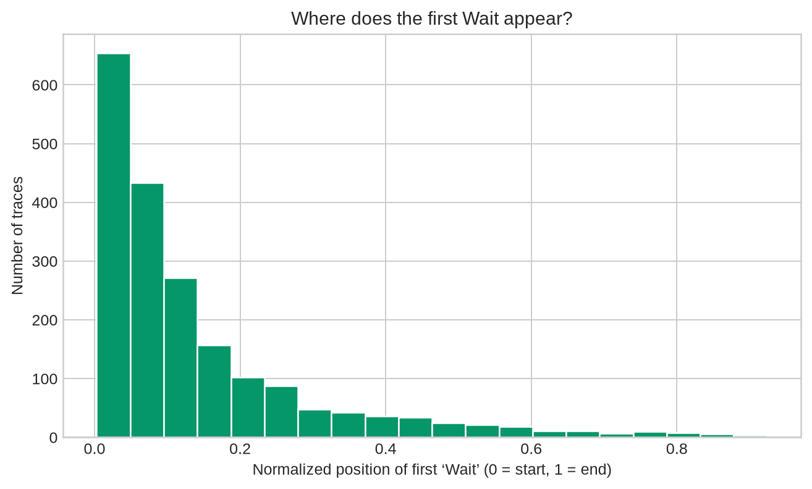

# Does “Wait” Mean the Model Corrected Itself?

## Executive Summary

### Research question

Reasoning models often write **“Wait”** immediately before revisiting a calculation or changing direction. DeepSeek’s report on R1 describes reflection, verification, and alternative-solution search as behaviors that emerge during reinforcement learning, and highlights an increase in “wait” during reflection [2]. That makes the word an attractive candidate for monitoring. If it marks a genuine correction, it might help us identify when a model notices an error. If it is simply a learned way of sounding thoughtful, it could be actively misleading.

### What I did

I analyzed 2,000 real reasoning traces from the public OpenThoughts-114k dataset. I sampled twenty evenly spaced 100-row slices from the 113,957-row training split, which gave me 1,500 math traces, 400 code traces, and 100 puzzle traces. For every occurrence of “Wait”, I inspected a local text window and searched for independent signs of revision, such as “I was wrong”, “reconsider”, “mistake”, or “let me verify”. I compared those windows with matched random-position windows from the same traces.

### Main findings

“Wait” was almost universal: it appeared in **99.3%** of the traces. The rate was 100.0% in code, 99.7% in math, and 90.0% in puzzles. The average trace contained **21.95** occurrences. This makes raw Wait frequency a poor monitor. However, Wait windows did contain independent correction-language evidence more often than matched positions: **43.9%** versus **25.6%**.

The result is a useful association, not a causal claim. These are static transcripts. They do not show whether the word “Wait” changed the model’s computation, whether the model had an earlier wrong state, or whether the explanation was written after the decision. I also found and corrected an initial circularity in my own metric: my first proxy counted the trigger word “Wait” as evidence of revision.

### Bottom line

The evidence suggests that “Wait” sometimes accompanies local revision, but it is too common and too easy to imitate to serve as a standalone faithfulness monitor. The next test should intervene on the model: compare cue-induced answer switches, Wait deletion or replacement, continuation resampling, and hand-checked transcripts on DeepSeek-R1-Distill-Qwen-7B. The strongest outcome would be a Wait-specific increase in independently validated correction that survives matched lexical controls. A null result would also be informative.

## Abstract

Chain-of-thought faithfulness matters because a readable reasoning trace is often treated as evidence about how a model arrived at an answer. This study examines whether the word “Wait” is a useful marker of self-correction in reasoning-model transcripts. I analyze 2,000 real traces from OpenThoughts-114k and compare local correction-language rates around Wait markers with matched random-position windows. Wait appears in 99.3% of the sampled traces, with a mean of 21.95 occurrences per trace. Independent correction-language cues occur in 43.9% of Wait windows and 25.6% of matched control windows. The result supports a modest association between Wait and revision-like language, but it does not establish causal influence or faithful reporting. The main finding is therefore a limitation: Wait is too frequent to be a useful standalone monitor. I conclude by specifying a paired-generation intervention for DeepSeek-R1-Distill-Qwen-7B and Qwen2.5-7B-Instruct that could distinguish genuine correction from post-hoc rationalization.

**Keywords:** chain-of-thought faithfulness; reasoning models; backtracking; interpretability; monitoring; DeepSeek-R1

## 1. Introduction

A reasoning trace can be useful even when it is not a complete record of the model’s internal computation. The problem begins when we treat a plausible explanation as if it were a faithful one. For safety monitoring, this distinction matters: a monitor that reads CoT may miss a concerning computation if the model can produce a clean explanation after the fact.

Previous work has studied this issue by inserting cues that change a model’s answer and checking whether the model acknowledges the cue in its reasoning [1]. That gives a practical behavioral test, but it leaves a narrower question open. Reasoning models often announce a change of direction with words such as “Wait”, “Actually”, or “Let me check”. Does that marker correspond to an actual change in the model’s solution process, or does it mainly provide the style of self-correction?

I focus on “Wait” because it is concrete, frequent, and linked to the public discussion of DeepSeek-R1’s emergent reflection behavior [2]. I do not assume that the word is meaningful. Instead, I ask whether it predicts revision-like text better than a simple positional control and whether the result is strong enough to justify a causal follow-up.

The central thesis is deliberately narrow: **“Wait” is associated with revision-like language, but static text alone cannot establish that it marks a causally important correction.** This distinction is the main contribution of the pilot.

## 2. Background and related work

The faithfulness literature distinguishes between an explanation that mentions the relevant evidence and an explanation that actually reflects the process that produced the answer. Chua and Evans operationalize one useful version of this distinction by inserting a cue that changes the model’s response and asking whether the model articulates the cue’s influence [1]. Their results suggest that reasoning models acknowledge such cues more often than several non-reasoning baselines, but the authors also note limitations of artificial tasks and the need for broader testing.

DeepSeek-R1 provides a related motivation from the training side. The paper reports that DeepSeek-R1-Zero develops longer reasoning, reflection, verification, and alternative approaches under reinforcement learning. It also reports that the model’s use of “wait” increases during a training-stage “aha moment” [2]. Those observations show why the marker is interesting. They do not show that the token is a reliable readout of an internal algorithm.

The MATS 12.0 admissions guidance makes the same methodological point in practical terms. It recommends work on CoT faithfulness, metrics for whether CoT tells us what we think, and the distinction between rationalization, hidden cue influence, shortcuts, and answer flipping [3]. It also warns that generic projects, missing baselines, and unverified agent-generated results are weak evidence. I therefore treat this study as an exploratory measurement exercise, not as a finished mechanistic account.

## 3. Method

### 3.1 Dataset and sampling

I used the `metadata` configuration of OpenThoughts-114k, which contains the problem, DeepSeek reasoning trace, final solution, ground-truth solution, domain, and source fields [4]. The training split contains 113,957 rows. I selected twenty evenly spaced slices of 100 rows each, producing 2,000 traces. This avoided a problem in an earlier pass, where the first 2,000 rows were almost entirely math examples.

The final sample contained 1,500 math traces, 400 code traces, and 100 puzzle traces. I used the fixed seed **20260815** for sampling qualitative examples. The raw API rows were saved alongside the derived metrics so that the analysis can be audited against the source data.

### 3.2 Measures

I counted case-insensitive occurrences of five marker families: `Wait`, `but`, `however`, `actually`, and phrases such as “let me check”. The main analysis concerns `Wait`. For each occurrence, I extracted 350 characters before the marker and 550 characters after it.

I then applied a deliberately weak reversal-language proxy. A window counted as positive if it contained an independent phrase such as “I was wrong”, “this is wrong”, “reconsider”, “mistake”, “misread”, “instead”, “on second thought”, “recalculate”, or “let me verify”. The proxy did **not** count the word “Wait” itself. This detail became important during verification: the first implementation did include “Wait”, which produced an apparently impressive but circular 100% result. I corrected the regex and reran the complete analysis.

For a baseline, I selected random-position windows from the same traces, avoiding positions close to actual Wait markers and choosing positions near the same normalized location in the trace. This control estimates how often correction-like language appears in ordinary long-form reasoning. It is not a causal intervention, and it does not match semantic content perfectly.

### 3.3 Verification and artifacts

The pipeline saves the raw rows, a per-trace CSV, a JSON summary, randomly selected qualitative examples, and three PNG figures. I checked the headline values after fixing the trigger-word circularity and inspected the figures for labeling and layout. The code and supporting artifacts are available in the accompanying repository [6].

## 4. Results

### 4.1 Wait prevalence

| Domain | Traces | Traces containing Wait | Mean trace length (words) |
|---|---:|---:|---:|
| Code | 400 | 100.0% | 4,939 |
| Math | 1,500 | 99.7% | 3,500 |
| Puzzle | 100 | 90.0% | 837 |
| **Overall** | **2,000** | **99.3%** | — |

The main result is the prevalence itself. A marker present in nearly every trace, often multiple times, has little discriminative value. It may still provide a useful segmentation boundary, but it cannot be treated as evidence that a particular reasoning step was important.

### 4.2 Comparison with matched positions

Across the sample, 43.9% of Wait windows contained the independent reversal-language proxy. The corresponding rate for matched random-position windows was 25.6%, based on 35,864 controls. The difference was 18.3 percentage points.

This result is compatible with the idea that Wait often appears near a local revision. It is also compatible with simpler explanations. Long math and programming traces contain many opportunities to say “instead”, “check”, or “correct”, and the model may have learned that these words make an answer look more careful. The static analysis cannot decide between these explanations.

### 4.3 What the raw traces look like

The qualitative sample contains both convincing and ambiguous cases. In one calculus trace, the model first rationalizes a denominator and then says, “But wait, let me verify if this is correct.” It independently checks the limit using L’Hôpital’s rule and reaches the same answer. This looks like verification, but it does not show that the Wait token caused the second derivation.

In a partition problem, the model uses “Wait” repeatedly while working through dynamic-programming details. Several of these markers introduce elaboration rather than reversal. The trace is useful and mostly coherent, but the marker is not a clean boundary between a wrong state and a corrected one.

A constrained-swap example contains several changes of hypothesis while the model works toward a connected-components solution. This is closer to what I would want from a backtracking monitor, but the same limitation remains: a fluent transcript does not reveal whether the underlying computation changed.

These examples suggest a stricter annotation rule for future work. A genuine correction should identify an earlier proposition, an error or contradiction, a changed proposition, and an independently checkable improvement. A marker alone is not enough.

## 5. Discussion

The pilot supports a limited conclusion. “Wait” is not random: it occurs near revision-like language more often than matched positions. But its near-universal prevalence makes it a poor standalone monitor, and the measurement is too close to the surface form to support a claim about internal reasoning.

This is a useful negative result for pragmatic interpretability. A vivid marker can be informative without being faithful. In practice, a monitor could use Wait to decide where to inspect a trace, but it should not treat the marker as evidence that the model noticed an error. The distinction is similar to the difference between a warning light and a diagnosis: the light can guide attention without telling us what happened inside the system.

The result also changes the next experiment. Rather than counting Wait more carefully, the next step should test whether a Wait segment matters. The target setup is a fixed prompt set with three conditions: an ordinary prompt, a cue designed to induce an answer switch, and a semantically irrelevant lexical cue. For each condition, I would sample multiple generations at fixed decoding settings and record answer changes, cue articulation, Wait timing, and answer-state consistency.

A stronger test would resample the continuation after a Wait segment while holding the prefix fixed. I would compare the original continuation with one in which Wait is replaced by a neutral token, and I would separately test deletion of the whole local correction segment. The latter matters because deleting one token can create an unnatural context. The analysis should compare against no-marker, generic-marker, random-position, answer-switch-without-Wait, and simple length/position baselines.

## 6. Limitations

The largest limitation is causal. The dataset contains static transcripts, not paired counterfactual generations, and it does not expose activations or token probabilities. The pilot cannot show whether Wait changed the model’s computation or whether the model wrote a correction-shaped explanation after deciding on an answer.

The reversal-language proxy is also imperfect. Words such as “instead”, “check”, and “correct” are common in ordinary explanations. The random-position control reduces the risk of mistaking general lexical density for a Wait effect, but it does not fully control for local semantics, task difficulty, or the model’s discourse structure.

The sample is not a deployment benchmark. It is drawn from OpenThoughts-114k, a dataset constructed for reasoning-trace generation and verification, and its domains are imbalanced. The reported values should therefore be read as pilot estimates for this corpus, not universal rates for all reasoning models.

Finally, the target models named in the proposed extension were not run in the CPU-only sandbox. The present numbers concern real DeepSeek-generated traces in OpenThoughts-114k, not fresh generations from DeepSeek-R1-Distill-Qwen-7B or Qwen2.5-7B-Instruct. I have kept that distinction explicit rather than substituting an unrelated model.

## 7. Conclusion

The evidence does not support using “Wait” as a standalone faithfulness signal. The marker appears in almost every sampled trace, and although it is more likely than a matched position to sit near correction-language, that association is compatible with ordinary discourse conventions and post-hoc rationalization.

The practical contribution is a narrower and more testable research question. A useful monitor should detect an independently validated answer-state transition and should survive lexical controls and continuation interventions. The current pilot supplies the observational baseline, the raw examples, the failure mode, and the reproducibility code needed for that next test.

## AI-assistance disclosure

I used language-model assistance for literature orientation, drafting alternatives, code review, and formatting. I retained responsibility for the research question, experimental design, metric definitions, sanity checks, interpretation, and final claims. The analysis code downloaded real public data, saved raw rows, and was rerun after an implementation error was discovered. The document should therefore be read as an AI-assisted but human-directed research write-up, not as an unverified model-generated report.

## References

[1]: https://arxiv.org/html/2501.08156v4 "Chua, Evans et al., Are DeepSeek R1 and other reasoning models more faithful?"
[2]: https://arxiv.org/html/2501.12948 "DeepSeek-AI, DeepSeek-R1: Incentivizing Reasoning Capability in LLMs via Reinforcement Learning"
[3]: file:///home/ubuntu/upload/NeelNandaMATS12.0Stream-AdmissionsProcedure+FAQ-GoogleDocs.pdf "Neel Nanda MATS 12.0 Stream Admissions Procedure and FAQ"
[4]: https://huggingface.co/datasets/open-thoughts/OpenThoughts-114k "OpenThoughts-114k dataset"
[5]: https://huggingface.co/Qwen/Qwen2.5-7B-Instruct "Qwen2.5-7B-Instruct model card"
[6]: https://github.com/Ishwarpatra/mats12-wait-faithfulness "MATS 12.0 Wait-faithfulness reproducibility repository"
